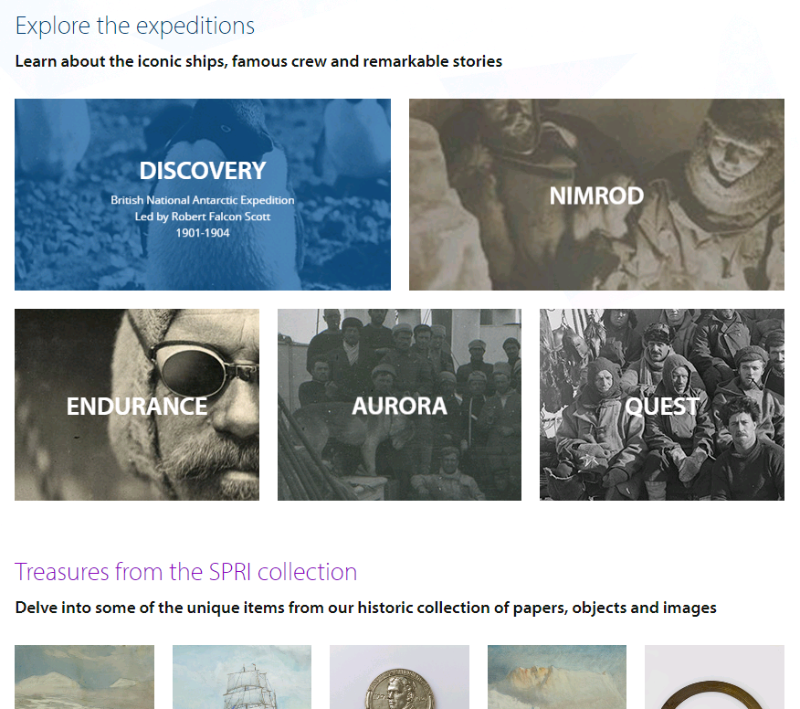

Shackleton online
=================

This is a PHP application which implements the Shackleton Online gallery.

Screenshot
----------

Usage
-----

1. Clone the repository.
2. Download the library dependencies and ensure they are in your PHP include_path.
3. Add the Apache directives in httpd.conf (and restart the webserver) as per the example given in .httpd.conf.extract.txt; the example assumes mod_macro but this can be easily removed.
4. Create a copy of the index.html.template file as index.html, and fill in the parameters.
5. Access the page in a browser at a URL which is served by the webserver.

Dependencies
------------

* [application.php application support library](http://download.geog.cam.ac.uk/projects/application/)
* [database.php database wrapper library](http://download.geog.cam.ac.uk/projects/database/)
* [frontControllerApplication.php front controller application implementation library](http://download.geog.cam.ac.uk/projects/frontcontrollerapplication/)
* [ultimateForm.php form library](http://download.geog.cam.ac.uk/projects/ultimateform/)
* [FamFamFam Silk Icons set](http://www.famfamfam.com/lab/icons/silk/)

Author
------

Design and templates by Tom Hare @colourgarden, 2016

Martin Lucas-Smith, Scott Polar Research Institute, Department of Geography, University of Cambridge, 2016.

License
-------

t.b.c.

